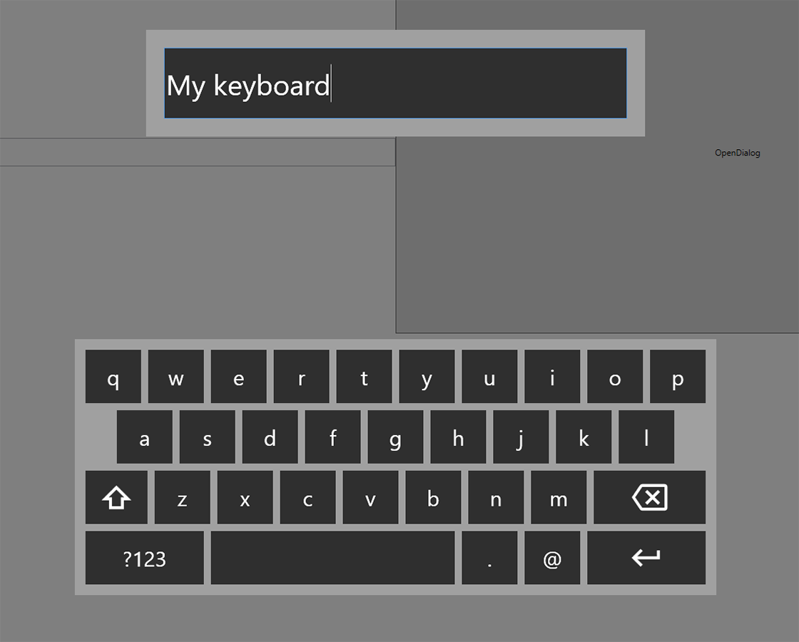

# VirtualKeyboard.Wpf

Virtual keyboard for wpf - designed to be used in kiosk-like applications

## Setup
Add style file to your main App.xaml resources
```
<Application.Resources>
	<ResourceDictionary>
		<ResourceDictionary.MergedDictionaries>
			<ResourceDictionary Source="pack://application:,,,/VirtualKeyboard.Wpf;component/ResourceDictionaries/DefaultStyles.xaml"/>
		</ResourceDictionary.MergedDictionaries>
	</ResourceDictionary>
</Application.Resources>
```
And you're ready to go

## Usage
To open keyboard window manually from either code-behind or view model, you just write
```
var value = await VKeyboard.OpenAsync();
```
You can also listen for click event on certain UIElement type to automatically open keyboard dialog and assign new value to certain property.
Just add (preferably in App.xaml startup event)
```
VKeyboard.Listen<TextBox>(e => e.Text);
```
Now every time you click on any TextBox - keyboard dialog will showup with default value of Text property, and will automatically assign new value.
** Hint ** You can combine it with checking for touch devices, so it will only listen when there is an available touch device.

## Custom styling
You can create your own style resource file and add it instead of a default one.
Additionaly you can specify your own Keyboard host window. Just create a new window with two ** ContentControl **controls - similar to DefaultKeyboardHost:
```
<Window x:Class="VirtualKeyboard.Wpf.DefaultKeyboardHost"
        xmlns="http://schemas.microsoft.com/winfx/2006/xaml/presentation"
        xmlns:x="http://schemas.microsoft.com/winfx/2006/xaml"
        xmlns:d="http://schemas.microsoft.com/expression/blend/2008"
        xmlns:mc="http://schemas.openxmlformats.org/markup-compatibility/2006"
        xmlns:local="clr-namespace:VirtualKeyboard.Wpf"
        mc:Ignorable="d"
        WindowState="Maximized" ShowInTaskbar="False" ResizeMode="NoResize" WindowStyle="None" AllowsTransparency="True">
    <Window.Background>
        <SolidColorBrush Opacity="0.5" Color="Black"/>
    </Window.Background>
    <Grid>
        <Grid.RowDefinitions>
            <RowDefinition Height="*"/>
            <RowDefinition Height="2*"/>
        </Grid.RowDefinitions>
        <Grid Grid.Row="0">
            <ContentControl MaxWidth="700" MaxHeight="150" x:Name="KeyboardValueContent"/>
        </Grid>
        <Grid Grid.Row="1">
            <ContentControl MaxWidth="900" MaxHeight="360" x:Name="KeyboardContent"/>
        </Grid>
    </Grid>
</Window>
```
Now just register new host
```
VKeyboard.Config(typeof(DefaultKeyboardHost));
```